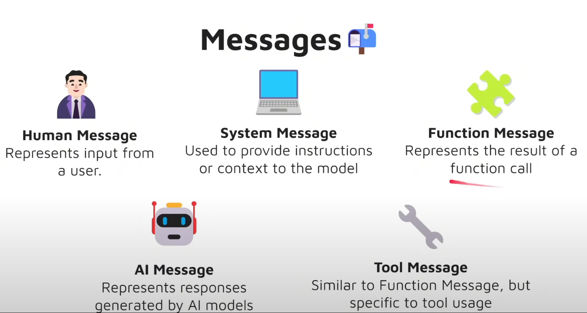

# langgraph_demo
this repo is for learning langgraph and building my first workflow for a realworld application

## Elements in Langgraph
* State - shared data structure that holds the current information or context
* Nodes
* Graph
* Edge
* Conditional Edge
* START point
* END point
* Tools
* ToolNode
* StateGraph
* Runnable
* Messages
    
